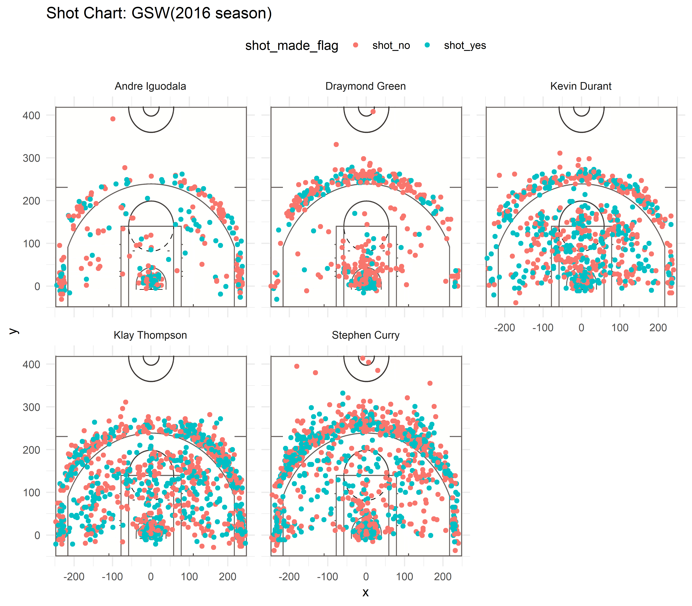

```{r setup, include=FALSE}
knitr::opts_chunk$set(echo = TRUE)
setwd("../report")
library(dplyr)
```


Everyone must have heard of the legend of the Golden State Warriors, which is famous for the high effective shots rate among NBA teams. Meanwhile, it is also a team with some talent basketball players like Stephen Curry and Kevin Durant. However, if you are not a basketball game like me, probably you have no idea about any professional evaluation on these players and what they are good at, what makes them outstanding, attracting millions of fans. From the following report, hopefully you can learn some characteristics of five of the most excellent players, **Andre Iguodala, Draymond Green, Kevin Durant, Klay Thompson and Stephen Curry**, from basic summative statistics and beautiful shots charts. More importantly, you can learn the fascination and power of computing with data.

```{r echo=FALSE, fig.align='center', out.width='70%'}

```


To begin with, we need to collect data about these five players. Thankfully, there are many GSW fans doing such work. They have been collecting the data about the number of shots they made, the types of shots, the positions, the time and so on in the season 2016. What we need to do is to download these prepared data files and read them using **read.csv** function in R. *For example*:
```{r echo=TRUE}
shots_data<-read.csv("../data/shots-data.csv")
```

Now there are so much valuable data for us to analyze. To narrow down, I chose to focus on the players¡¯ effective shots rate since shot has always been the most exciting moment in a basketball game. And it is probably the easiest way to know the players.


First, let¡¯s look at the facetted shot chart of these players. The chart visualizes the positions of shots they made. The red points stand for the failed shot and the blue ones stand for the successful shots. Basically, what we can see is the number of their shots, the types (positions) of their shots and the rough effective rates of their shots. 
```{r echo=FALSE, fig.align='center', out.width='80%'}

```

Obviously, Kevin Durant, Klay Thompson and Stephen Curry made many shots during this season as the dots are very dense in their charts. They should be the key scorers in GSW. 

Another thing worth discussing is the players¡¯ ability of making 3-points shots, which requires comprehensive strength. Roughly, the chart shows Green and Curry have a bit higher 3-points shots percentages among the five players. Especially Curry made a lot of 3-points shots with high percentage of success. There is no wonder why he is so popular with NBA fans. Besides, Durant and Thompson also made a great contribution by many 3-points shots. Some statistics details will be compared in the analysis. 

Last, as for the effective rates of shot, though there are 2 color helping us intuitively tell the shots, we still need more specific number to analyze further.

Second, let¡¯s compare the effective shot rates of 

In season 2016, we compared the numbers of shots made, the numbers of scored shots made and the percentages of the scored shots among the five players by summarizing the data in a data tibble in R (as the following code and tibble). Apparently, Kevin Durant had the highest altogether effective shots rate in season 2016.

####Table1: Effective Shooting % by Player (overall)

```{r}
arrange(summarise(group_by(shots_data,player),total=sum(shot_made_flag=="shot_yes"|shot_made_flag=="shot_no"),made=sum(shot_made_flag=="shot_yes"),perc_made=made/total),desc(perc_made))
```

Let¡¯s look at the 2-points field goals. The one who had the highest effective 2-points shots rate is Andre Iguodala. Even though he only made 210 2-points shots, he had 134 scored ones. The rate is about 64%, very high number in NBA games. And generally, the scored shots rates are about 50% and higher, which shows the competitiveness of Golden State Warriors.

#### Table2: 2PT Effective Shooting % by Player

```{r}
library(dplyr)
pt2<-filter(shots_data,shots_data$shot_type=="2PT Field Goal")
arrange(summarise(group_by(pt2,player),total=sum(shot_made_flag=="shot_yes"|shot_made_flag=="shot_no"),made=sum(shot_made_flag=="shot_yes"),perc_made=made/total),desc(perc_made))
```

Finally, let¡¯s look at the summary of 3-points shots. Stephen Curry is well deserved to be the 3-points goals contributor with 687 total shots and 280 effective shots. Also, Thompson was good at it in season 2016 with the highest effective rate of 42.41%.  

#### Table3: 3PT Effective Shooting % by Player

```{r}
pt3<-filter(shots_data,shots_data$shot_type=="3PT Field Goal")
arrange(summarise(group_by(pt3,player),total=sum(shot_made_flag=="shot_yes"|shot_made_flag=="shot_no"),made=sum(shot_made_flag=="shot_yes"),perc_made=made/total),desc(perc_made))
```

According what we have discussed above, briefly, we can know that all the five players are basketball super stars with considerable high effective shots rates. **Andre Iguodala** is good at 2-points shots and maybe a good defender since he made fewest shots. **Kevin Durant** is quite aggressive with highest effective shots rate in season 2016. **Klay Thompson** is outstanding in the effective rate of 3-points shots. The superstar **Stephen Curry**, making the most shots in season 2016, is famous for his superb long-range shooting technique.

Such is some basic information from statistics data analysis for those who have no idea about Golden State Warriors. Hopefully you really get what you want to learn and are attracted by the data analysis.

**Thanks for reading.** 


